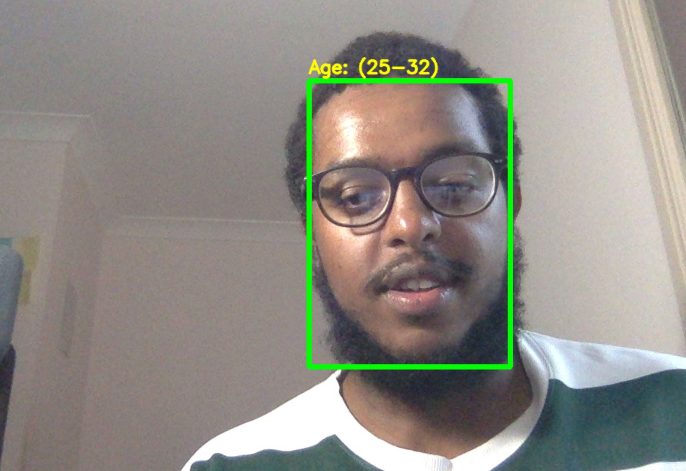

# AI Decoded Age Prediction
This package predicts the age from face images

  

### Getting Started
To get a local copy up and running follow these simple example steps.

1. Download or clone the ai-decoded-predict-age package
Click on the code button at the top.

2. Download & Install Python 3.9
[Python 3.9](https://www.python.org/downloads/)

3. Install Open CV Module
Run `pip install opencv-python`

4. Open commandline to the package & execute the predict_age file
Run `python predict_age.py`

